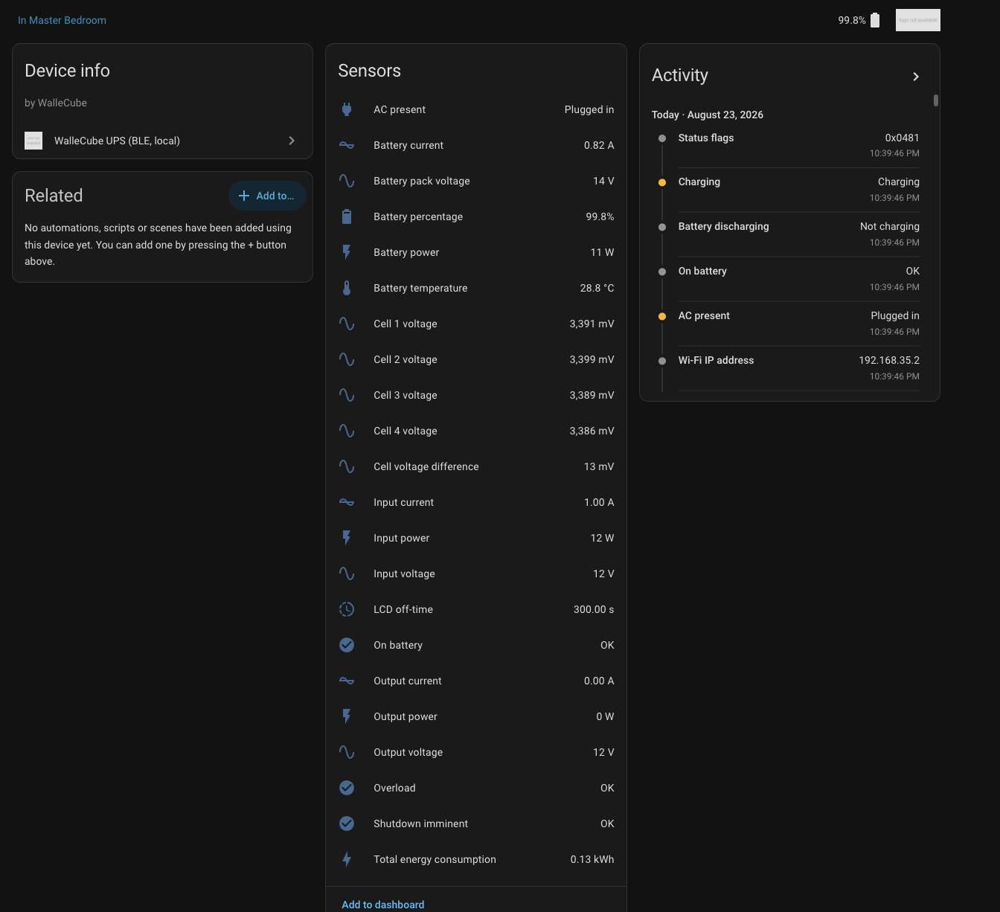
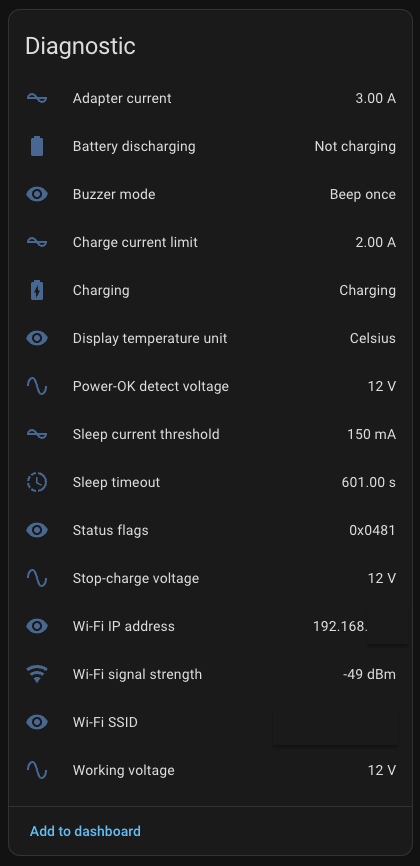
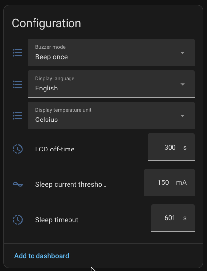
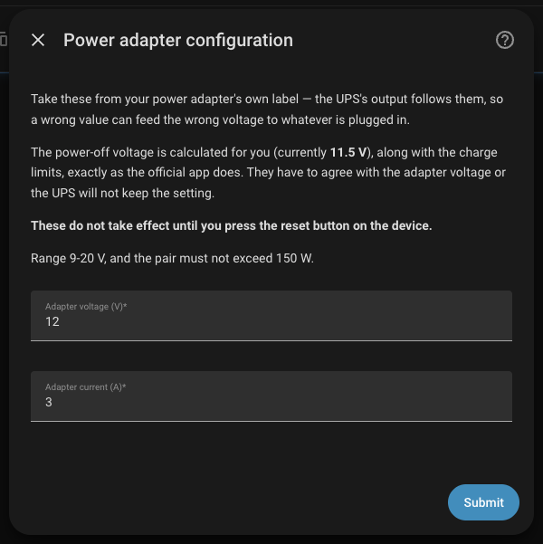

# WalleCube UPS — Home Assistant integration

Local Bluetooth LE monitoring and control for WalleCube mini-UPS units.
**No cloud, no vendor app, no MQTT broker, no credentials sent anywhere.**

[![hacs][hacs-badge]][hacs] [![release][release-badge]][releases] [![license][license-badge]][license]

The official app offers two paths: Wi-Fi with cloud MQTT (the device phones
home to WalleCube's broker), or Bluetooth LE for setup and live monitoring —
undocumented, app-only. This integration implements the BLE path, so the UPS
is fully usable with zero WalleCube infrastructure involved. Not even
pairing is required.

Tested against a **W150**. The protocol is likely shared with the W180.



---

## What you get

### Telemetry — no configuration needed

Pushed by the device roughly once per second, in cleartext.

| | |
| --- | --- |
| **Power** | Input / output voltage and current · output, input and battery power (W) · total energy consumption (kWh, works with the HA energy dashboard) |
| **Battery** | State of charge (%) · pack voltage · charge/discharge current · temperature |
| **Cells** | Individual voltage for each of the 4 cells, plus the max–min spread — a growing spread is the classic early sign of pack imbalance |
| **Status** | **AC present** · **On battery** · Overload · Shutdown imminent · Charging |

`AC present` and `On battery` are the two that make this worth having:
they're what you hang "shut the NAS down when mains drops" on. A live
AC-loss test confirmed the BLE link stays up for the whole outage (462
frames, largest gap 1.26 s over 9 minutes), so the UPS keeps reporting while
running on battery.

Watts are `V × A` — the device doesn't report power directly, and the app's
own display derives it the same way.

### Device settings — needs your device's AES key

Read straight off the `F0B*` characteristics as plain GATT reads:

- Sleep timeout and sleep current threshold
- Buzzer mode, display language, display temperature unit
- Power-adapter config: adapter current, charge current limit, working
  voltage, stop-charge voltage, power-OK detect voltage



### Writable settings — needs the key *and* auth code

| Entity | Type | Range |
| --- | --- | --- |
| Buzzer mode | `select` | Mute / Beep once / Repeat |
| Display language | `select` | English / 中文 |
| Display temperature unit | `select` | Celsius / Fahrenheit |
| Sleep timeout | `number` | 20–7200 s |
| Sleep current threshold | `number` | 20–3000 mA |
| LCD off-time | `number` | 10–36000 s |



Plus **Wi-Fi diagnostics** (SSID, IP, signal strength)

Every write is verified by reading the value back, and raises if the stored
value differs. Settings are polled every 10 minutes rather than on the
telemetry interval: they change rarely, and this device's BLE stack does not
appreciate being hammered.

### Power adapter

**Settings → Devices & Services → WalleCube UPS → Configure → Power
adapter.** Voltage (9–20 V) and current, describing the PSU you physically
attached. It lives in the options flow rather than as an entity because it's
set once when hardware changes and **is not applied until you press the
reset button on the device** — the wrong shape for something you can drag on
a dashboard. The 150 W ceiling is checked on the voltage/current *pair*,
which no static min/max can express.



### Not supported

**Outlet control** — this model has no individually switchable outlets, so
there is nothing to control.

**Runtime remaining** — the device doesn't report it over BLE

***Wi-Fi configuration** — theoretically possible, but have not implemented it yet.

---

## Installation

### HACS

Add this repository as a custom repository (type: *Integration*), install
**WalleCube UPS**, and restart Home Assistant.

### Manual

Copy `custom_components/wallecube_ble/` into your Home Assistant
`config/custom_components/` directory and restart.

### Setup

The UPS is auto-discovered if Home Assistant — or an ESPHome Bluetooth
proxy — is in range and it's advertising as `Walle-*`. Otherwise add it via
**Settings → Devices & Services → Add Integration → WalleCube UPS** and
enter its BLE MAC address.

Telemetry works immediately, with no further configuration.

> Home Assistant holds a single persistent GATT connection, so the official
> app can't be connected to the UPS at the same time.

### Optional: unlock the settings channel

The AES key and auth code can be derived from *your own* device.
I have only tested this on my own W150, so I cannot say for sure if the AES key
and auth-code is unique per model or per device or universal. The app prints
them to logcat, so you can get them without any special tools. I have no reason
to believe they are universal.

If you do obtain yours, please reach out to me so we can confirm whether they are unique per device or per model.

To get yours:

1. Enable **USB debugging** on your phone, connect it, and clear the log:

   ```bash
   adb logcat -c
   ```

2. Open the official WalleCube app and connect to your UPS over Bluetooth.

3. Trigger a setting read/write in the app by navigating to **Advanced Configuration → Power Adapter Config** and pressing **Write Config**. This will cause the app to print the AES key and auth code to logcat.

4. Read them straight out of the log:

   ```bash
   adb logcat -v brief "flutter:I" "*:S"
   ```

   ```log
   I/flutter: aesSecret = <32 hex characters>
   I/flutter: authCode  = <a decimal number>
   ```

5. Enter both under **Settings → Devices & Services → WalleCube UPS →
   Configure → Credentials**, and reload the integration.

The key alone enables the read-only settings sensors; the auth code adds the
writable entities and Wi-Fi diagnostics. Until we can verify if these are
universal, treat both as personal secrets and don't share or commit them.

---

## How this was reverse-engineered

The full wire format lives in **[PROTOCOL.md](PROTOCOL.md)**. The route
there, briefly:

1. **Confirm BLE is the only local path.** No useful ports on the device's
   Wi-Fi IP — just a stub TCP/53
2. **Try passive capture, and abandon it.** Android's `btsnooz` blob
   truncates every ACL packet to 3 bytes of ATT value, and recent builds
   omit the full HCI log from `adb bugreport` entirely. Good enough to map
   GATT handles, useless for payloads. A rooted phone may capture the full
   HCI log, but I don't have one at the moment.
3. **Pull the APK** — a Flutter app, so jadx yields only generic
   `flutter_blue_plus` glue. The protocol is AOT Dart inside `libapp.so`.
4. **`strings` on `libapp.so`** recovers the real characteristic UUIDs and
   confirms AES + PointyCastle.
5. **Hook the app with Frida** (`objection patchapk`, no root) at the
   `BluetoothGatt` layer — below the app's own encryption — for full,
   untruncated bytes on every write and notification.
6. **Statistical analysis** — min/max per byte across ~235 samples,
   cross-referenced live against the app's on-screen readings — pins down
   the telemetry frame.
7. **Disassemble the Dart** with [blutter][blutter] to recover the
   encryption scheme, and discover the app's release build still `print`s
   `aesSecret` and `authCode` to logcat. Three commands beat a crypto
   attack.
8. **Verify end-to-end** by replaying a captured query, re-encrypted with
   the recovered key, and matching the decrypted response against the app's
   own display.

**Getting a write offset wrong does not fail safe.** Misaligned frames
aren't rejected — the device reads whatever bytes land in the payload and
*clamps them into its own valid ranges*, so the write succeeds at the GATT
layer while storing plausible-but-wrong values. That's why every write here
is verified by read-back. And read-back only proves the value reached RAM:
for anything persisted, the real test is write, reset, read again. A 12 V
adapter write once read back as 12 V and came up as 9 V after a reset, with
the UPS genuinely outputting 9.02 V.

---

## Troubleshooting

**Entities stuck unavailable.** Check the HA host or Bluetooth proxy is in
range, and that the official app isn't holding the connection.

**No settings entities.** They only appear once credentials are configured —
the read-only ones need the AES key, the writable ones need the auth code
too. Reload the integration after entering them.

**The UPS stops responding to everything, including the official app.** Its
BLE stack can wedge after heavy connect/disconnect cycling. Press the reset
button on the device — unplugging AC won't do it, since the battery keeps it
running. Avoid restarting Home Assistant in a tight loop while debugging.

---

## Related work

- [xswxm/home-assistant-wallecube][xswxm] — the cloud MQTT approach:
  requires sniffing IMEI/device-key credentials and an ongoing dependency on
  WalleCube's servers.

## Disclaimer

Not affiliated with or endorsed by WalleCube. Reverse-engineered from a
device I own, for interoperability with my own hardware. The adapter-voltage
setting changes real electrical thresholds — the safeguards here are
described above, but you are responsible for your own hardware.

Tested on a W150 running System ver 1.20 and UPS ver 1.29, app version 1.24.0.
Running on any other hardware or firmware is at your own risk.
The protocol may change in future firmware updates, and this integration may break.

## License

Copyright (C) 2026 Josh Burks.

This program is free software: you can redistribute it and/or modify it
under the terms of the **GNU General Public License, version 3** as
published by the Free Software Foundation, either version 3 of the License,
or (at your option) any later version.

This program is distributed in the hope that it will be useful, but WITHOUT
ANY WARRANTY; without even the implied warranty of MERCHANTABILITY or
FITNESS FOR A PARTICULAR PURPOSE. See the [LICENSE](LICENSE) file, or
<https://www.gnu.org/licenses/>, for details.

[hacs]: https://github.com/hacs/integration
[hacs-badge]: https://img.shields.io/badge/HACS-Custom-41BDF5.svg
[release-badge]: https://img.shields.io/github/v/release/jeburks2/wallecube-bt-ha
[releases]: https://github.com/jeburks2/wallecube-bt-ha/releases
[blutter]: https://github.com/worawit/blutter
[xswxm]: https://github.com/xswxm/home-assistant-wallecube
[license]: LICENSE
[license-badge]: https://img.shields.io/badge/license-GPL--3.0-blue.svg
